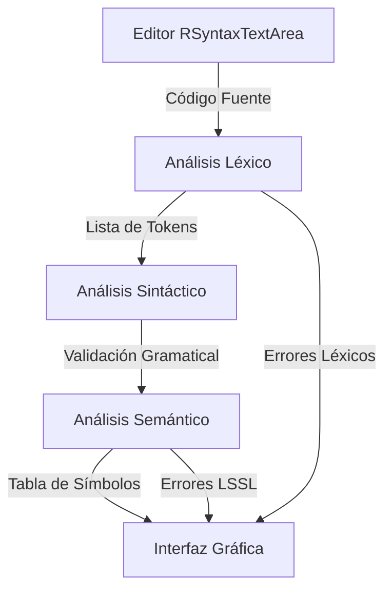

# Documentación Técnica - IDEstudioV2

Esta documentación describe en detalle la arquitectura técnica y el funcionamiento interno del compilador integrado en IDEstudioV2.

## 1. Arquitectura General

El compilador sigue una arquitectura secuencial dividida en tres fases principales que interactúan a través de un **Repositorio Central** (`code.semantico.Repositorio`).

## 2. Componentes Principales

### 2.1 Gestor de Compilación (`GestorCompilador.java`)
Es el componente orquestador. Su método `ejecutarCompilacion()` coordina el flujo completo:
1.  Limpia el estado previo del `Repositorio`.
2.  Inicia el análisis léxico para obtener tokens.
3.  Ejecuta el análisis sintáctico.
4.  Lanza el análisis semántico para construir la tabla de símbolos y validar la lógica.
5.  Notifica a la interfaz gráfica para actualizar la consola y la tabla de símbolos.

### 2.2 Análisis Léxico (`code.lexico`)
-   **Herramienta:** JFlex (generado a partir de `AnalizadorLexico.flex`).
-   **Función:** Clasifica el código fuente en tokens (Identificadores, Palabras Reservadas, Operadores, Símbolos de Puntuación).
-   **Manejo de Errores:** Los caracteres no reconocidos se marcan con la categoría `ERROR` para ser procesados posteriormente.

### 2.3 Análisis Sintáctico (`code.sintactico`)
-   **Clase:** `AnalizadorSintactico.java`.
-   **Función:** Verifica que el orden de los tokens siga las reglas gramaticales del lenguaje (ej. estructura de programas, sentencias de control, declaración de variables).
-   **Validación de Paréntesis:** Utiliza `FiltroParentesis` para asegurar que las expresiones estén correctamente balanceadas.

### 2.4 Análisis Semántico (`code.semantico`)
Es la fase más compleja, compuesta por múltiples sub-procesos:
-   **`TablaSimbolos`:** Almacena información sobre variables, constantes y parámetros (nombre, tipo de dato, valor y categoría).
-   **`ProcesadorAsignaciones`:** Valida que los tipos de datos sean compatibles en las operaciones de asignación.
-   **`EvaluadorExpresiones`:** Calcula y valida la lógica de las expresiones matemáticas y lógicas.
-   **`AnalizadorSemantico`:** Centraliza las llamadas para construir la tabla de símbolos y validar el alcance (scope) de las variables.

## 3. Flujo de Datos y Estado

### Repositorio Central (`Repositorio.java`)
Actúa como un bus de datos que mantiene:
-   `listaTokens`: Lista completa de tokens generados en el análisis léxico.
-   `listaErrores`: Lista de errores (Sintácticos/Semánticos) de tipo `ErrorLSSL`.
-   `tablaSimbolos`: Mapa con todos los identificadores válidos detectados.

### Gestión de Errores
-   Los errores se capturan en una lista centralizada.
-   El IDE utiliza esta lista para resaltar las líneas erróneas en rojo en el editor (`errorTab`).
-   Se genera un reporte detallado en la consola con el formato: `[Error N] Línea: X, Columna: Y, Detalle: Z`.

## 4. Dependencias y Bibliotecas Externas

-   **RSyntaxTextArea:** Proporciona las funcionalidades avanzadas de edición y resaltado.
-   **CompilerTools:** Proporciona las clases base `Token` y `ErrorLSSL` para estandarizar el flujo del compilador.

---
© 2026 IDEstudioV2 - Documentación Técnica Interna.
